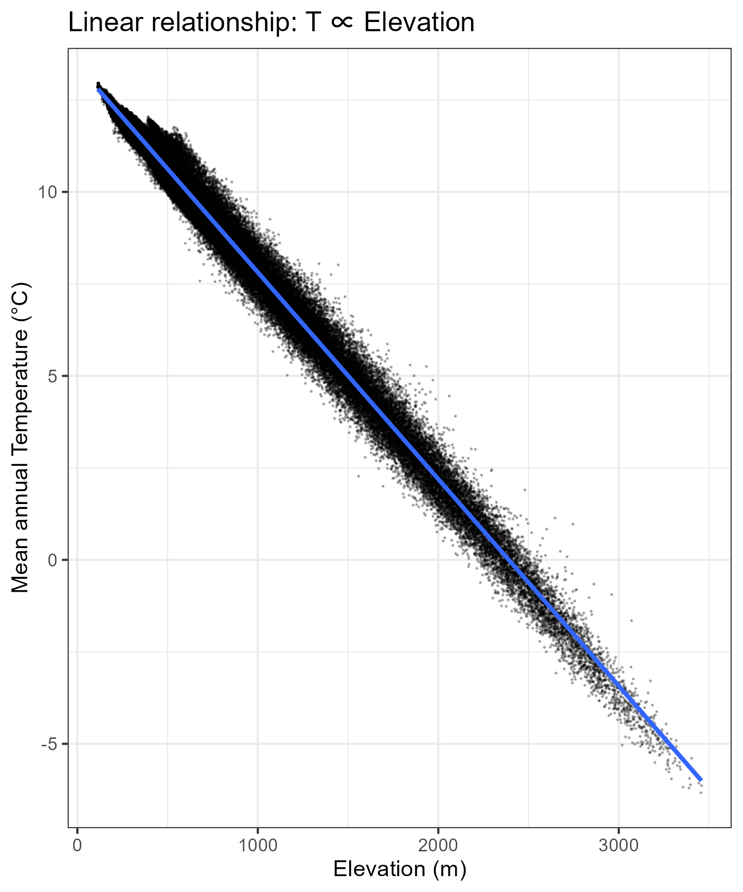
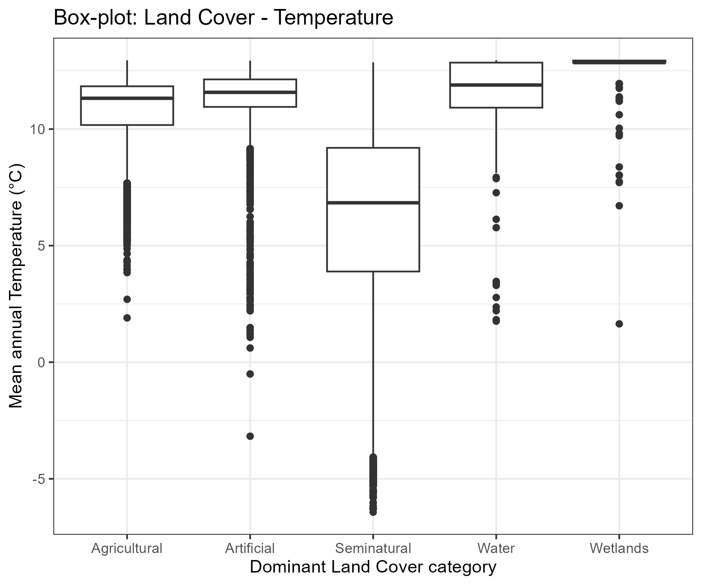
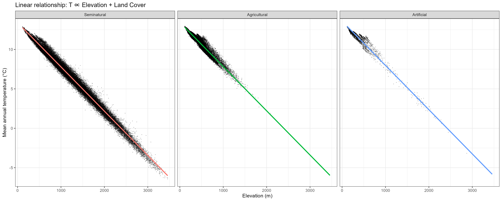
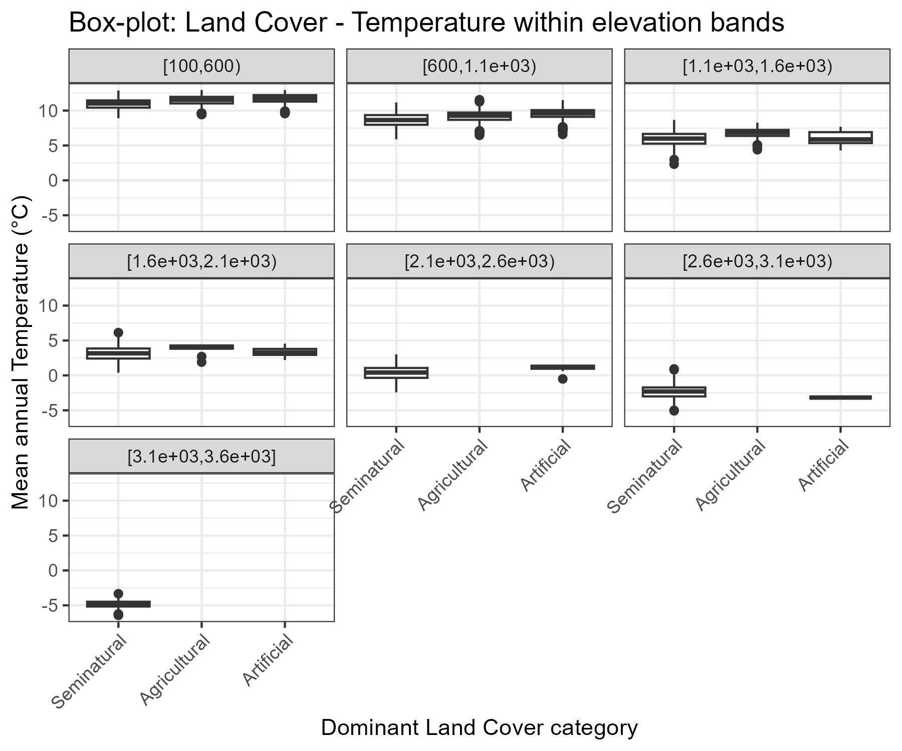

# Austria Surface Temperature - Land Cover analysis

This repository provides a reproducible R workflow to explore how **surface temperature** relates to **elevation** and **land cover** across Austria. In particular, this repository uses CHELSA, Corine Land Cover (CLC) and Digital terrain Model (DGM) open source data to build a **1 km² grid over Austria** and run a small set of statistical analyses to explore relationships between:
- **Mean annual temperature** (`temp`; CHELSA bio01d, year 2018),
- **Elevation** (`dgm`; Digital terrain model Austria),
- **Land cover composition** (`clc`; Corine Land Cover, year 2018).

The workflow is split into three scripts: **data preparation → analyses → plots**, plus a testing script and a `functions.r` file.  
A brief description of all parts is given in the next paragraph. In addition, if you use `RStudio`, an RStudio project file called `software-project.Rproj` is included to ensure the scripts run correctly. A brief description of all parts is given below. In addition, an RStudio project file called `software-project.Rproj` is included to ensure the scripts run correctly.

---


## Requirements

### Software
- **R** (recent version recommended)
- **RStudio**

### R packages
Used across scripts:
- tidyverse, sf, terra, exactextractr, rnaturalearth
- broom, rstatix
- yaml, testthat
- beepr (optional “done” sound)

To install:
```r
install.packages(c(
  "tidyverse", "sf", "terra", "exactextractr", "rnaturalearth",
  "broom", "rstatix", "yaml", "testthat", "beepr"
))
```


## Setup

This repository does **not** include the raw input datasets (since they are large), so you need to create the local folder structure and place the downloaded files where the scripts expect them.

### 1) Create these folders

In the project root, create:
  - `data/` (raw inputs + generated `clean_data.gpkg`)
  - `outputs/` (saved plots)


### 2) Download the datasets

The pipeline expects **three rasters** in `data/`:

- **Corine Land Cover (CLC) 2018**  
   - File: `data/U2018_CLC2018_V2020_20u1.tif`  
   - Type: categorical raster (integer codes)
   - Used as categorical: it is reprojected using nearest-neighbor resampling 

- **CHELSA bio01d (2018)**  
   - File: `data/CHELSA_EUR11_obs_bio01d_2018_V.2.1.nc`  
   - Type: NetCDF raster
   - Values: stored as 0.1 Kelvin in the raw product, later converted to °C in the script

- **Digital Terrain Model (DGM) Austria**  
   - File: `data/dhm_at_lamb_10m_2018.tif`  
   - Type: continuous raster (elevation)
   - Used as continuous: it is reprojected using bilinear resampling

The datasets are listed in `DATA_SOURCES.md`. See the file for the official download pages and licensing. After downloading, place them inside the `data/` folder so that these paths exist:
  - `data/U2018_CLC2018_V2020_20u1.tif`
  - `data/CHELSA_EUR11_obs_bio01d_2018_V.2.1.nc`
  - `data/dhm_at_lamb_10m_2018.tif`

> **Note:** If your filenames differ, change the patterns in `data_sources.yml` rather than changing the scripts.

### 3) Input file configuration (`data_sources.yml`)

The pipeline reads `data_sources.yml` to locate the input rasters using filename patterns for each dataset (CLC, CHELSA, DGM).  This makes the workflow easier to reproduce across machines without hard-coded local paths.  
The default file names already work. If you pattern differs, update the file `data_sources.yml` (no need to edit the scripts).


## How to run

Run scripts in order:
- **0)** `0-data_preparation.r` &rarr creates `data/clean_data.gpkg`
- **1)** `1-data_analysis.r` &rarr reads `data/clean_data.gpkg` and then runs statistics and model comparisons
- **2)** `2-plots.r` &rarr produces and saves graphs into `outputs/`

If you prefer running from the terminal:
```r
Rscript 0-data_preparation.r
Rscript 1-data_analysis.r
Rscript 2-plots.r
```
> **Note:** If using `RStudio`, it's recommended to open the RStudio project (`software-project.Rproj`) so the working directory is the project root.


## Project workflow/ Brief scripts description


### 0) Data preparation (`0-data_preparation.r`)

Main steps:
- reads data_sources.yml and configures the three inputs (CLC, CHELSA bio01d, DGM)
- reprojects rasters to **EPSG:3035 (ETRS89 / LAEA Europe)**, *[1]*
  - CLC (categorical): nearest-neighbour (method = "near"),
  - temperature & elevation (continuous): bilinear (method = "bilinear"),
- clips all rasters to the Austria polygon (from Natural Earth),
- creates a **1 km² grid** and clips it to Austria borders,
- extracts per-cell:
  - area-weighted mean **temperature** (`temp`),
  - area-weighted mean **elevation** (`dgm`),
  - land-cover macro-category composition (%) from CLC codes: `perc_artificial`, `perc_agricultural`, `perc_forest_semi`, `perc_wetlands`, `perc_water`, `perc_no_data`.

The output is saved as:
- `data/clean_data.gpkg` (created locally in your `data/` folder)

>**Note:** Reprojecting large rasters to EPSG:3035 can be slow and memory-intensive. Make sure you have enough space and patience!


### 1) Data analysis (`1-data_analysis.r`)

Main steps:
- loads `data/clean_data.gpkg` and drops geometry for tabular analyses,
- **Pearson correlation**: `cor.test(temp, dgm)` between temperature and elevation,
- **linear model**: `lm(temp ~ dgm)`,
- assigns a **dominant land cover** class when a macro-category cover is > 50%,
- focuses analyses on the three dominant classes with enough data: Artificial, Agricultural, Seminatural,
- **tests** temperature differences across land-cover categories using:
  - Welch’s ANOVA (robust to unequal variances / sample sizes),
  - Games–Howell post-hoc comparisons,
- **fits** and **compares**:
  - baseline model: `temp ~ dgm`,
  - extended model: `temp ~ dgm + dominant_cover` (with Seminatural as reference level),
  - nested-model F-test + AIC comparison


### 2) Plots (`2-plots.r`)

Creates and saves the following figures in `outputs/`:
- `outputs/linear_model_Temperature-Elevation.png` &rarr Scatter plot: Temperature vs Elevation (+ regression line),
- `outputs/boxplot_Land_Cover-Temperature.png` &rarr Boxplot: Temperature by dominant Land Cover category,
- `outputs/linear_model_Temperature-Elevation-Land_Cover.png` &rarr Scatter plot: Temperature vs Elevation and Land Cover,
- `outputs/boxplot_Land_Cover-Temperature-Elevation.png` &rarr Boxplot: Temperature by dominant Land Cover category by Elevation ranges.


### 3) Testing (`testing.r`)

The file `testing.r` uses `testthat` to check the project workflow. In particular:
- Check that core spatial inputs exist and have valid geometry and shared CRS
- Verify clipped rasters keep expected resolution and extent
- Executes tests on `area_weighted_mean` and `clc_cover_df` functions
- Tests key analysis passages such as `dominant_cover` assignment and reference-level selection


### 4) Functions (`functions.r`)

The file defines two functions used as summary functions inside `exact_extract` for raster–polygon extraction. The two functions are:

*`area_weighted_mean(values, coverage_fraction)`*
- Checks that `values` and `coverage_fraction` have the same length
- Keeps only valid pairs (finite value + finite weight + weight > 0)
- Computes the coverage-fraction-weighted mean: `sum(values * weight) / sum(weight)`


*`clc_cover_df(values, coverage_fraction)`*, that:
- Builds a small data frame of CLC codes (`values`) and weights (`coverage_fraction`)
- Drops NA codes, returns a one-row NA result if no valid pixels or total weight is 0
-	Sums weighted cover for CLC macro-categories by code ranges: artificial (1–11), agricultural (12–22), semi-natural (23–34), wetlands (35–39), water (40–44), no-data (48)
-	Returns a one-row `data.frame` with the percentage of each macro-category in the polygon for every grid cell


## Repository structure

Files (in the repository):
```txt
0-data_preparation.r
1-data_analysis.r
2-plots.r
functions.R
testing.r
data_sources.yml
DATA_SOURCES.md
README.md
software-project.Rproj
```

Local folders (created by the user):
```txt
data/
  (raw inputs: CLC, CHELSA bio01d, DGM)
  clean_data.gpkg

outputs/
  linear_model_Temperature-Elevation.png
  boxplot_Land_Cover-Temperature.png
  linear_model_Temperature-Elevation-Land_Cover.png
  boxplot_Land_Cover-Temperature-Elevation.png

```

## Outputs

After running the full pipeline, you will find different files created:
- Data (saved in `data/`): `data/clean_data.gpkg` is a 1 km² grid over Austria with extracted variables (`temp`, `dgm`, `clc` % composition),
- Figures (saved in `outputs/`): the different plots are listed below.


### 1) Temperature vs Elevation relationship

[](outputs/linear_model_Temperature-Elevation.png)

**Figure:** `outputs/linear_model_Temperature-Elevation.png`

This scatter plot shows the relationship between **elevation** (x-axis, meters) and **mean annual temperature** (y-axis, °C) for all 1 km grid cells.  
Each dot represents one grid cell and the blue line is the fitted linear regression (`temp ~ dgm`).

Observations:
- The points form a very **narrow diagonal band**, indicating a strong and almost linear **decrease of temperature with elevation** at this spatial scale.
- The band is not perfectly “thin” and the **vertical spread** around the line reflects influences not included in the model (regional gradients, local topography aspect, valley effects and important limitations due to dataset resolution).
- A few points lie farther from the band (visible especially at mid–high elevations). These are cells whose temperature is higher/lower than expected from elevation alone.

This plot is mainly a **baseline** and shows how much structure is already explained by elevation before introducing land cover.


### 2) Dominant land cover classes and temperature differences

[](outputs/boxplot_Land_Cover-Temperature.png)

**Figure:** `outputs/boxplot_Land_Cover-Temperature.png`  

The boxplot compares the temperature distribution across dominant categories.  
Each grid cell is assigned a **dominant land-cover macro-category** when one category covers **> 50%** of the cell. Two things to know:
- The **median line** in each box gives the typical temperature for that land-cover class.
- The **box height** (IQR) captures variability within the middle 50% of cells; whiskers and dots show more extreme values/outliers.

Observations:
- **Seminatural** cells show a much **lower median** and a **wider spread** than Agricultural/Artificial. This is consistent with the fact that seminatural cover is more common at higher elevations (colder conditions).
- **Agricultural** and **Artificial** have relatively **high medians** and tighter boxes, consistent with their concentration in lowlands and valleys.

>**Note:** Differences here are *not automatically* “land cover effects”. Much of the separation can come from **different elevation distributions** across classes (e.g., seminatural occurring more often at higher altitude).


### 3) Improving predictions by studying the relation between land cover classes and temperature

[](outputs/linear_model_Temperature-Elevation-Land_Cover.png)

**Figure:** `outputs/linear_model_Temperature-Elevation-Land_Cover.png`

This figure focuses on the three main dominant classes with enough data: **Seminatural**, **Agricultural**, **Artificial**.  
Each dot represents one grid cell and the colored line is the fitted model prediction from:
- Baseline: `temp ~ dgm`
- Extended: `temp ~ dgm + dominant_cover` (Seminatural as reference)

Observations:
- The model is **additive** (no interaction), so the **slope with elevation is the same** for all classes, 
  Differences between classes appear as a **vertical shift** (different intercepts) at the same elevation, 
- If one line tends to sit above another at comparable elevations, it suggests a systematic offset associated with that land cover after controlling for elevation,


### 4) Land cover differences within elevation bands

[](outputs/boxplot_Land_Cover-Temperature-Elevation.png)

**Figure:** `outputs/boxplot_Land_Cover-Temperature-Elevation.png`

This plot stratifies the data into **500 m elevation bands** (facets) and comparing land-cover categories **within each band**.

Observations:
- As elevation increases, the temperature distributions shift downward (as expected),
- At low elevations ([100, 600), [600, 1100)) all three classes appear and medians are relatively close, with small offsets,
- At mid/high elevations, some classes disappear (e.g., **Agricultural** becomes rare/absent), and **Seminatural** dominates the remaining bands,
- If differences between land-cover categories persist **within the same elevation band**, that supports an association not explained only by altitude, 
- If differences shrink within bands, it suggests that the separation seen in the global boxplot is largely driven by **where** each land cover occurs along the elevation gradient,
- In the highest bands, sample sizes for some classes are extremely small or zero, so conclusions there should be treated as descriptive only.


> **Notes:**
  - Results depend on the choice of the grid resolution (here 1 km²) and the threshold used for defining a dominant land-cover class ( here > 50%).
  - Climate rasters represent gridded temperature fields at their native resolution; local microclimates are not resolved. Interpretation should also consider dataset limitations and resolution.
  - Land cover (CLC) is simplified into macro-categories, finer CLC classes may reveal additional patterns.


## Results

Overall, the results confirm that elevation is the dominant driver of mean annual temperature at 1 km resolution in Austria, and they also suggest that dominant land-cover classes are associated with systematic temperature differences. While part of the land-cover signal reflects the different elevation ranges where each class occurs, the additive modelling and the elevation-band comparison indicate that land cover may contribute additional, interpretable variation beyond elevation alone, within the limits of data coverage at higher elevations.  
Here there are some key takeaways:

- **Elevation is the main driver of temperature at 1 km scale.**  
  The Temperature–Elevation scatter shows a very strong, clean negative relationship, confirming that the pipeline captures the expected climatic gradient across Austria.

- **Dominant land-cover classes capture meaningful spatial structure.**  
  The boxplots show systematic temperature differences among dominant categories (Seminatural vs Agricultural/Artificial), consistent with how these covers are distributed across the Austrian landscape.

- **Land cover may add explanatory power beyond elevation (within data-supported ranges).**  
  In the additive model (`temp ~ dgm + dominant_cover`), the predicted lines show vertical offsets between classes, suggesting land-cover-associated differences after controlling for elevation—especially where each class has sufficient observations.


## Limitations & next steps

- **Confounding by elevation:** part of the land-cover signal reflects the fact that different covers occur at different altitudes.  
  The elevation-band plot already addresses this; a next step could be to quantify sample sizes per band and class to highlight where comparisons are robust.

- **Uneven class coverage across elevation:** Agricultural/Artificial cells are concentrated at low elevations, so predictions at high elevations are effectively extrapolations.  
  A next step could be restricting inference to the overlapping elevation range of the compared classes.

- **Model structure:** the current model is additive (parallel slopes).  
  If you want to test whether land cover changes the *temperature lapse rate*, you could fit an interaction model (e.g., `temp ~ dgm * dominant_cover`) and compare it to the additive one.

Despite these limitations, the analysis provides a consistent baseline and a clear framework for extending the model.

---

*[1] EPSG:3035 (ETRS89 / LAEA Europe) is a projected CRS (specific Geographic Coordinate Reference System) widely used for pan-European environmental analysis, particularly for statistical analysis and environmental monitoring, because it uses the Lambert Azimuthal Equal-Area projection (LAEA) to accurately represent areas across the continent. It's based on the European Terrestrial Reference System 1989 (ETRS89) datum and is centered around 52°N, 10°E, providing true-to-scale area representation for pan-European data.*
